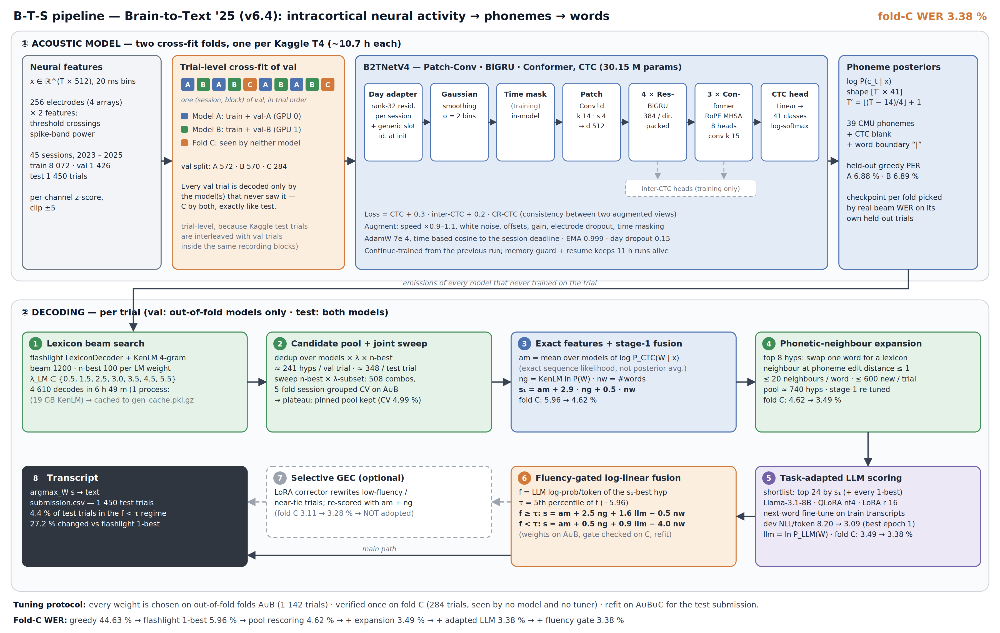
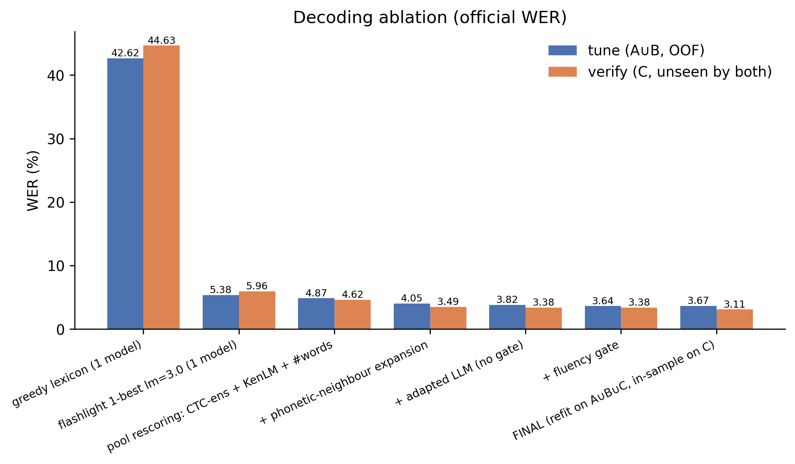
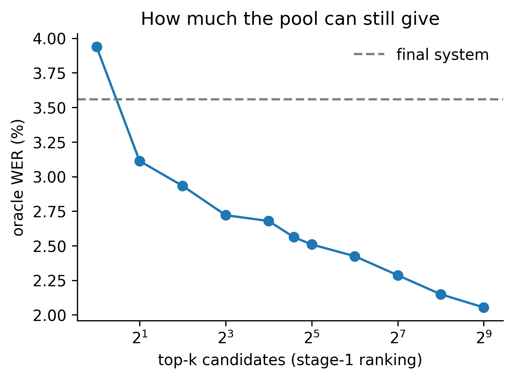
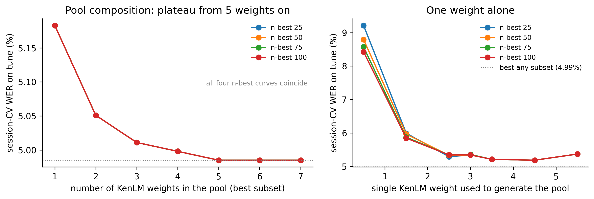
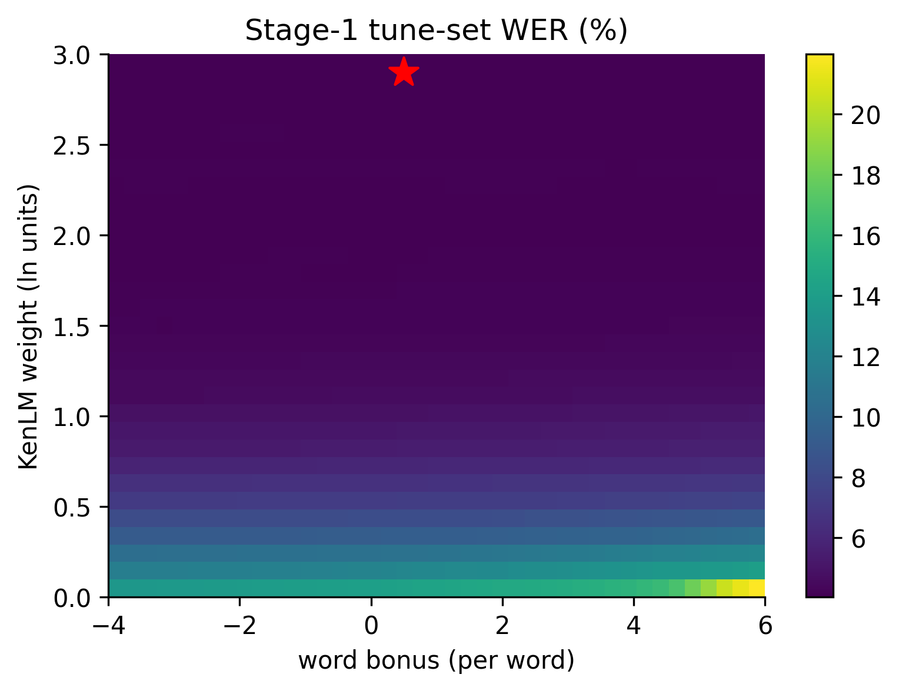
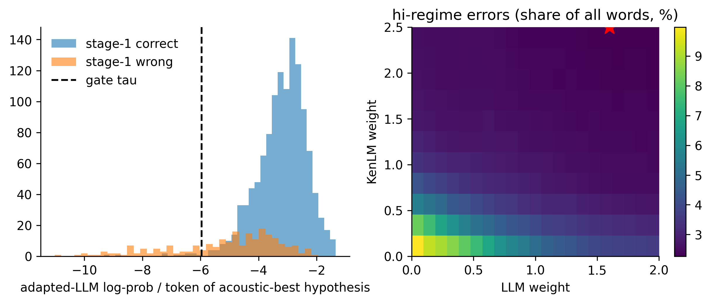
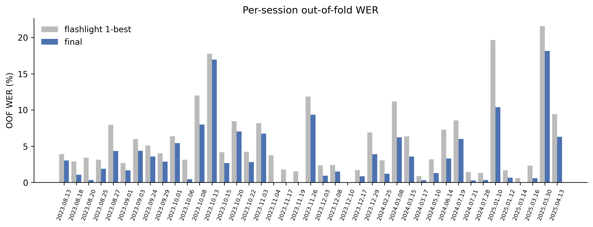
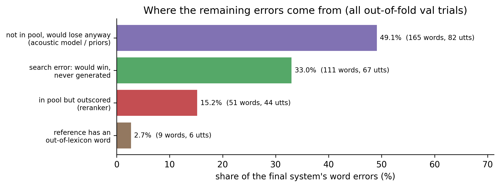

# Brain-to-Text v6.4 — Cross-Fit Conformer CTC + Wide KenLM Search + Fluency-Gated LLM Fusion


Neural-speech decoding pipeline for the Kaggle
**[brain-to-text-25](https://www.kaggle.com/competitions/brain-to-text-25)** competition: 512-channel
intracortical recordings of attempted speech in, English sentences out.

Two **Patch-Conv → BiGRU → Conformer** acoustic models are trained with **phoneme CTC + inter-CTC +
CR-CTC** on a **trial-level cross-fit** of the validation set. Every trial is decoded by the models that
never saw it with a lexicon-constrained **KenLM 4-gram beam search (beam 1200, 7 LM weights)**, the pool
is widened with **phonetic-neighbour substitutions**, candidates are scored by **exact CTC sequence
likelihood** and a **QLoRA-adapted Llama-3.1-8B**, and the scores are combined by **fluency-gated
log-linear fusion** whose weights are tuned on out-of-fold trials and verified on a fold that nothing was
selected on.

**Fold-C WER 3.38 %** (the honest estimate) · all out-of-fold 3.59 % · down from 3.87 % / 4.35 % in v6.2.

This is the modularized, repo-ready version of the Kaggle notebooks in [`notebooks/`](notebooks/).

---

## B-T-S Pipeline Architecture



<sub>Every number in the figure comes from `config.py` or from the reference run's tables in
[`results/`](results/). Source: [`assets/bts_pipeline.svg`](assets/bts_pipeline.svg), regenerate with
`python scripts/draw_pipeline.py`.</sub>

**How to read it.** Lane 1 runs once per fold at training time: the cross-fit split decides which
validation trials each acoustic model may see, and each model maps 20 ms bins of neural features to
per-frame phoneme log-probabilities. Lane ② runs per trial at decoding time: a wide beam search turns
those posteriors into an n-best pool of word sequences (1→2), the pool is rescored by exact acoustic
likelihood plus an n-gram prior (3), widened with near-homophone substitutions (4), shortlisted and
scored by a task-adapted LLM (5), and fused with weights that depend on how fluent the utterance looks to
the LLM (6). The optional generative corrector (7) was evaluated and rejected by the fold-C check.

---

## Results

All numbers are **official WER** (Σ word edits / Σ reference words after punctuation removal) on
**out-of-fold** validation trials: fold A is decoded by model B, fold B by model A, fold C by both —
exactly the situation of the test set.

| System | tune (A∪B) | **verify (C)** | all OOF |
| ------ | ---------: | -------------: | ------: |
| greedy lexicon, 1 model (no LM) | 42.62 | 44.63 | 43.02 |
| flashlight 1-best, KenLM λ = 3.0, 1 model | 5.38 | 5.96 | 5.49 |
| pool rescoring: exact-CTC ensemble + KenLM + #words | 4.87 | 4.62 | 4.82 |
| + phonetic-neighbour expansion | 4.05 | 3.49 | 3.94 |
| + task-adapted Llama-3.1-8B (no gate) | 3.82 | **3.38** | 3.74 |
| **+ fluency gate** (shipped) | **3.64** | **3.38** | **3.59** |
| FINAL (refit on A∪B∪C — in-sample on C) | 3.67 | 3.11 | 3.56 |
| *oracle: pool, no expansion* | *3.16* | *1.99* | — |
| *oracle: pool + expansion* | *2.27* | *1.13* | — |
| *oracle: LLM-scored top-24* | *2.69* | *1.56* | — |

**Read the verify (C) column.** Fold C (284 trials) was seen by neither acoustic model and selected on by
no tuner, so it is the only unbiased estimate. The tune column is what the weights were optimised on and is
optimistic by construction. The FINAL row is refit on all three folds, so it is in-sample on C — it is the
system that produced the submission, not an estimate of anything. Oracle rows are the WER a perfect
reranker would get from that candidate list.

Acoustic models (EMA weights, each on the trials it never trained on):

| Fold | Init | Checkpoint used (screen WER, beam 50) | PER | greedy-lexicon WER |
| ---- | ---- | ------------------------------------- | --: | -----------------: |
| A (seed 0) | warm start from v6.1 | `best_per.pt` (7.61 %) | 6.88 % | 43.87 % |
| B (seed 1) | warm start from v6.1 | `best_wer.pt` (7.46 %) | 6.89 % | 42.30 % |

Final decode configuration ([`results/best_weights.json`](results/best_weights.json)):

```
generation   beam 1200 · n-best 100 · KenLM λ {0.5, 1.5, 2.5, 3.0*, 3.5, 4.5, 5.5}      (*1-best reference only)
pool         λ {0.5, 1.5, 2.5, 3.5, 4.5, 5.5} x n-best 100   (joint sweep: pinned pool kept, CV 4.99 %)
expansion    top 8 hypotheses · <= 20 neighbours per word · <= 600 new strings per trial
stage 1      s1 = am + 2.9 ng + 0.5 nw
LLM          meta-llama/Llama-3.1-8B, QLoRA nf4 r 16, NWP fine-tune: dev NLL/token 8.20 -> 3.09, top-24 scored
gate         5th percentile of LLM log-prob/token (tau = -5.96)
   f >= tau  s = am + 2.5 ng + 1.6 llm - 0.5 nw
   f <  tau  s = am + 0.5 ng + 0.9 llm - 4.0 nw
GEC          evaluated, not adopted (fold C 3.11 -> 3.28 %, -3 words, SE 1.6)
```

### What changed from v6.2 — and what it bought

Same checkpoints, same acoustic model, same decoding code; only the decoding hyperparameters and the
tuning procedure changed (full list in [`CHANGELOG.md`](CHANGELOG.md)).

| Stage (fold C) | v6.2 | **v6.4** | Δ |
| -------------- | ---: | -------: | --: |
| flashlight 1-best | 6.66 | 5.96 | −0.70 |
| pool rescoring | 5.42 | 4.62 | −0.80 |
| + expansion | 4.67 | 3.49 | −1.18 |
| + LLM + fluency gate | 3.87 | **3.38** | −0.49 |
| oracle: pool + expansion | 2.20 | 1.13 | −1.07 |

| Knob | v6.2 | v6.4 |
| ---- | ---- | ---- |
| beam | 400 | **1200** |
| KenLM weights | 4–6 (swept) | 6 pinned + 3.0 for the 1-best |
| n-best | 25–75 (swept) | 100 (swept 25/50/75/100 by CV, kept) |
| expansion (top, max_nb, max_new) | (3, 12, 600) | **(8, 20, 600)** |
| pool sweep | staged coordinate descent, scored in-sample | **joint sweep, 5-fold session-grouped CV + paired-SE guard** |
| stage-2 grid | swept ranges + `tol_rel` + `llm_topk` | one fixed grid, smoothed argmin |
| generative correction | — | optional, fold-C gated |

The oracle column is the story: the wider beam and the wider expansion halved the pool's oracle WER on
C, and the rerankers converted most of that into real WER.

---

## Figures

All figures are written by `decode_llm.py` to `figures/` (PNG + PDF, 300 dpi); the copies below are from
the reference run.

### Decoding ablation


Each bar pair adds one stage. The largest single step after the beam search is the phonetic-neighbour
expansion (−1.13 pp on C): about 95 % of the remaining errors are substitutions, and no reranker can pick
a word that is not in its list. The fluency gate helps on tune (3.82 → 3.64) but is neutral on C
(3.38 → 3.38); it is kept because the pipeline only drops it when it *hurts* on C.

### How much the pool can still give


Oracle WER of the top-k candidates under the stage-1 ranking (all OOF trials). The shipped system (dashed,
3.56 %) sits between the top-1 and top-2 oracle: a perfect choice between just the two best candidates
would already beat it, and the full expansion-augmented pool holds a 2.05 % solution.

### Pool composition — joint sweep


Left: best session-CV WER as a function of how many KenLM weights feed the pool. Right: a pool generated
at a single weight. Pools built from five or more of the seven weights sit on one plateau (24 of 508
combinations tie at 4.985 %, paired gap 0.00 pp), and n-best beyond 25 changes nothing once the pool is
diverse in λ. A single weight costs 0.2 pp (λ 4.5) to 3.4 pp (λ 0.5). The pinned pool was therefore kept —
the gains of v6.4 came from beam width and expansion, not from pool composition.

### Stage-1 weight surface


Tune-set WER over (KenLM weight, word bonus) with the LLM off, after expansion. The optimum (★,
ng 2.9 / nw 0.5) lies in a broad, flat valley: below a KenLM weight of ~1 the n-gram prior is too weak,
above ~1.5 almost any word bonus works.

### Fluency gate and LLM weight surface


Left: LLM log-prob per token of the acoustic-best hypothesis. Utterances the stage-1 system gets wrong
dominate the low-fluency tail, consistent with the non-grammatical random-word stimuli, where a fluency
prior is the wrong prior.
Trials left of τ (5 %) get a much weaker LLM weight and a strongly negative word bonus. Right: the
high-fluency regime's error surface over (KenLM, LLM); the chosen point (★) sits on the upper KenLM edge
of the grid — see *Known limitations*.

### Per-session WER


Out-of-fold WER per recording session, flashlight 1-best vs final. Five sessions exceed
max(2 × median, median + 5 pp) with median 2.68 % — `2025.03.30` (18.1 %), `2023.10.13` (16.9 %),
`2025.01.10` (10.4 %), `2023.11.26` (9.4 %), `2023.10.08` (8.0 %). They hold 11 % of the trials but
**40 % of all word errors** ([`results/outlier_days_analysis.csv`](results/outlier_days_analysis.csv)).
Two of them (`2023.10.13`, `2023.11.26`) send over 40 % of their trials through the low-fluency regime.

### Where the remaining errors come from


Every wrong utterance of the final system, classified. For utterances whose reference was never
generated, the reference is scored under the final weights: if it would have won, the error is a **search
error** (33 % of word errors — more search would fix it); if it would still lose, the scores themselves
are wrong (49 % — acoustic model and priors). Only 15 % are the reranker preferring a wrong candidate
that was in the list.

---

## Why the pipeline looks the way it does

Each design choice is a fix for a measured failure, not a preference.

**Trial-level cross-fit, not a held-out block.** Kaggle's test trials are interleaved with val trials
*inside the same recording blocks*. Holding out whole blocks would measure a different, easier problem. So
val is labelled `A/B/A/B/C` by trial inside every (session, block); fold A's model trains on train +
val-A, fold B's on train + val-B, and C is left for verification.

**Exact CTC likelihood, not posterior averaging.** Averaging two models' frame posteriors destroyed WER in
v2 (66 %) because independently trained CTC models spike at different frames. Candidates are instead
scored by `log P(phones | x)` from a CTC forward pass per model and averaged — alignment-free, so
ensembling is well-defined.

**Search before a bigger reranker.** About 95 % of errors are substitutions, and a reranker can only pick
from what is in its list. v6.4 spent its budget on search — beam 1200 and a wider expansion — which cut the
pool's oracle WER on C from 2.20 % to 1.13 % and the shipped WER from 3.87 % to 3.38 %. The error analysis
says the next point is still more likely to come from search (33 % of errors) than from reranking (15 %).

**A fluency gate, because a fluency prior is wrong for some trials.** Part of the stimulus set is
non-grammatical word sequences, where an LM that prefers fluent English actively hurts. The gate splits
utterances at a percentile of the LLM's per-token score and tunes a separate weight vector for each side.

**Cross-validate the sweep, and make the winner beat the default by more than noise.** v6.2 picked its
pool from a staged sweep scored on the same trials it was fitted on; its winning margin (0.35 pp bootstrap
sd, 21 rivals inside it) was noise. v6.4 fits stage-1 weights on K−1 groups of *sessions* and scores the
held-out group, and switches away from the pinned pool only if the CV winner is ≥ 1 paired SE better.
It was not — the sweep's honest answer was "any diverse pool is the same".

**Vetoes on C for anything optional.** The gate is dropped if it is worse on C than no gate; GEC is adopted
only if its fold-C gain clears 1 × the paired-bootstrap SE. Fold C never *picks* a weight.

**A memory guard instead of hoping (training).** v6.0's workers were OOM-killed by the kernel after 27
minutes. The worker now watches its own RSS, saves state and exits with code 75 before the kernel can act,
and the launcher relaunches it with `--resume`.

**Nothing is allowed to lose the submission.** A valid `submission.csv` exists from the first decoding
stage onward (greedy → flashlight 1-best → full pipeline) and every later stage is soft.

---

## Known limitations and next steps

- **A final weight sits on a grid edge.** The high-fluency KenLM weight (2.5) equals the maximum of
  `STAGE2_GRID['ng']`, and the no-gate stage-2 optimum hit the LLM maximum (2.0) too. `decode_llm.py` now
  prints a warning when this happens; widening the stage-2 grid is cheap (seconds per grid).
- **GEC's acoustic floor has an OOV loophole.** A generated sentence with an out-of-lexicon word has no CTC
  score and is compared on LM + length only; 33 of the 34 accepted val rewrites were OOV. Set
  `GEC_CFG['reject_oov'] = True` for the next attempt (the default `False` reproduces the reference run).
- **Five sessions carry 40 % of the errors.** Four of them have greedy PER 11–22 % — acoustic-model
  problems, where session adaptation rather than decoding is the lever. `2023.11.26` is the exception
  (PER 3.3 %, WER 9.4 %, 41 % of trials in the low-fluency regime): a decoding / prior problem.
- **Search errors are still a third of all errors.** Expansion to two-word substitutions or a larger
  `expand_top` is the next search-side experiment; beam width is expensive (generation is 6 h 49 m at 1200).
- **The gate is neutral on C** with this pool. It is cheap and never hurt, but it no longer earns its
  complexity on unseen data.

---

## Project structure

```
.
├── config.py                 # single source of truth: paths + every hyperparameter
├── train.py                  # cross-fit training launcher (supervises one worker per GPU)
├── predict.py                # fast baseline: greedy CTC -> submission
├── decode_llm.py             # full pipeline: beam + sweep + expansion + LLM fusion (+ GEC) -> submission
├── evaluate.py               # post-hoc report: CER, S/D/I breakdown, bootstrap sd, per-day
├── src/
│   ├── utils.py              # seeding, path resolvers, scratch-disk picker, atomic save, memory probes
│   ├── dataset.py            # HDF5 -> float16 cache, pread reader, cross-fit split, bucketing, GPU augs
│   ├── model.py              # B2TNetV4 (day adapter, patch Conv1d, BiGRU, Conformer), losses, EMA
│   ├── metrics.py            # official normalisation, WER/CER/PER, lexicon, greedy decode, bootstrap
│   ├── decoding.py           # flashlight beam pool, KenLM, expansion, exact-CTC features, LLM, tuner
│   ├── inference.py          # checkpoint screening, emissions, pools, beam-search cache, weight grids
│   ├── sweep.py              # joint n-best x KenLM-weight-subset sweep, session-grouped CV   (new)
│   ├── gec.py                # selective generative error correction                         (new)
│   ├── analysis.py           # ablation, oracle, fluency, per-day, error analysis, figures   (new)
│   └── train_worker.py       # one process = one GPU = one fold (crash-proof)
├── scripts/
│   ├── draw_pipeline.py      # regenerates assets/bts_pipeline.{svg,png}
│   └── build_kenlm.sh        # OPTIONAL one-time KenLM CLI build
├── assets/                   # architecture figure + figures of the reference run
├── results/                  # aggregate tables of the reference run (see results/README.md)
├── notebooks/                # the Kaggle notebooks the code was modularized from
├── checkpoints/              # training output bundle lands here (gitignored)
├── submission/               # submission.csv lands here (gitignored)
├── CHANGELOG.md
├── requirements.txt
├── CITATION.cff
└── LICENSE
```

## The acoustic model

`B2TNetV4` (see [`src/model.py`](src/model.py)), 30.15 M parameters, ~7.1 GB peak on a T4:

1. **Low-rank day adapter** — rank-32 residual per session plus a generic slot for sessions no fold trained
   on. Exact identity at init (`V` zero-init, scale as `1 + gain`), so weight decay pulls a session toward
   the shared solution rather than toward zero. Day dropout (0.15) keeps the generic slot usable.
2. **Gaussian smoothing** — fixed depthwise kernel, std 2 bins.
3. **In-model time masking** — applied after smoothing, before patching.
4. **Patch embedding as a strided Conv1d** (patch 14, stride 4) — identical to a linear layer on unfolded
   patches, but never materialises the `[B, T', 512·14]` tensor.
5. **4 × residual BiGRU** (hidden 384 per direction, packed, `enforce_sorted=False`).
6. **3 × Conformer block** — RoPE attention (8 heads), conv module (kernel 15) with per-frame LayerNorm
   (the old `GroupNorm(1, C)` over `[C, T]` leaked padded-frame statistics into valid frames), macaron FFNs,
   stochastic depth.
7. **Phoneme CTC head** (41 classes: 39 CMU phonemes + blank + word boundary) + two inter-CTC auxiliary
   heads (after the GRU stack and after Conformer block 2).

Training: AdamW (lr 7e-4, day parameters at 2×), **time-based** cosine that lands on `lr_min` exactly at
the session deadline, CTC + 0.3 inter-CTC + 0.2 CR-CTC between two augmented views, EMA weights for every
checkpoint and every evaluation.

## Data

Kaggle **brain-to-text-25** HDF5 files: 512 features per 20 ms bin (threshold crossings and spike-band
power of 256 electrodes), phoneme IDs and sentence transcripts, split `train` / `val` / `test`, one folder
per recording day — 45 sessions, 8 072 / 1 426 / 1 450 trials
([`results/dataset_summary.csv`](results/dataset_summary.csv)). On Kaggle it is mounted at
`DEFAULT_DATA_DIR` in `config.py`. Locally:

```bash
kaggle competitions download -c brain-to-text-25
python train.py --data_dir /path/to/hdf5_data_final
```

The first run writes a ~10 GB float16 cache to scratch disk (`/tmp/b2t_cache` by default). **Do not** put it
on a tmpfs mount; that is what OOM-killed v6.0.

## Setup

```bash
pip install -r requirements.txt
# OPTIONAL — only to rebuild a KenLM binary from scratch (the pipeline resolves a prebuilt 4-gram binary
# from a Kaggle dataset):
bash scripts/build_kenlm.sh
```

`meta-llama/Llama-3.1-8B` is gated: export `HF_TOKEN` with an accepted licence (on Kaggle, attach it as a
secret), or pass `--llm_name Qwen/Qwen2.5-1.5B` for an ungated, much cheaper alternative.

## Usage

### 1. Train (≈ 11.5 h on 2 × T4) — unchanged from v6.2

```bash
python train.py --data_dir /path/to/hdf5_data_final --checkpoint_dir checkpoints
python train.py --init_ckpt_dir /path/to/previous_bundle      # continue a previous run
python train.py --folds A                                     # one GPU only
```

Writes the bundle `decode_llm.py` needs: `fold{A,B}_seed{0,1}_{best_wer,best_per,ema_final}.pt`,
`norm_stats.pt`, `split.json`, `sil_convention.json`, `trained_days.json`, `manifest.json`. See
[`checkpoints/README.md`](checkpoints/README.md). On Kaggle: run this as one session, *Save Version*, and
create a dataset from the output folder.

### 2. Baseline predictions (minutes, no LM)

```bash
python predict.py --checkpoint_dir checkpoints --output submission/submission_baseline.csv --report_val
```

### 3. Full pipeline (≈ 9 h on 2 × T4, ≈ 2 h with a cached beam search)

```bash
python decode_llm.py --checkpoint_dir /path/to/b2t_v6_ckpt --output submission/submission.csv
# re-run everything after the beam search in ~2 h:
python decode_llm.py --checkpoint_dir /path/to/b2t_v6_ckpt --gen_cache work/gen_cache.pkl.gz
```

| Flag | Meaning | Default |
| ---- | ------- | ------- |
| `--gen_cache PATH` | reuse / write the beam-search cache (fingerprinted: beam, n-best, λ, checkpoints) | `<work>/gen_cache.pkl.gz` |
| `--no_sweep` | skip the joint n-best × λ-subset sweep, keep the pinned pool | sweep on |
| `--no_gec` | skip the optional generative correction (~45 min, no effect on the reference submission) | GEC on |
| `--no_llm` | acoustic + n-gram rescoring only | LLM on |
| `--no_finetune` | skip QLoRA, score with the base LLM | fine-tune on |
| `--beam` / `--nbest` | override generation width / depth | 1200 / 100 |
| `--llm_name` / `--llm_batch` | rescoring LLM and its scoring batch | Llama-3.1-8B / 16 |
| `--n_proc` | beam-search processes (auto-capped by free RAM) | 3 |

Outputs: `submission/submission.csv`; `tables/` — `ablation_decoding.csv`, `best_weights.json`,
`joint_sweep_all_combos.csv`, `gate_search.csv`, `oracle_vs_k.csv`, `outlier_days_analysis.csv`,
`clean_days_analysis.csv`, `error_analysis_*.csv`, `oof_predictions.csv`, `test_predictions_detail.csv`,
`val_predictions.csv`, `gec_summary.json`, `llm_finetune_history.json`; `figures/` — every figure above.

Where the time goes in the reference run (2 × T4, 8 h 53 m total):

| Stage | Time |
| ----- | ---: |
| cache build + checkpoint screening + emissions | ~13 min |
| beam search: 4 610 decodes × 7 λ at beam 1200, **one** process (19 GB KenLM) | **6 h 49 m** |
| joint sweep (508 combos) + features + expansion | ~6 min |
| QLoRA fine-tune (2 epochs) + scoring 69k hypotheses | ~1 h 05 m |
| analysis + GEC fine-tune and evaluation | ~40 min |

Only `beam` (and anything that forces a new generation fingerprint) is expensive; everything downstream of
the cache is minutes, which is why the cache exists.

### 4. Post-hoc report

```bash
python evaluate.py
# -> tables/{ablation,per_day_analysis,error_breakdown}.csv, tables/val_summary.json
#    figures/{ablation_wer,wer_by_day}.png
```

### 5. Redraw the architecture figure

```bash
pip install cairosvg && python scripts/draw_pipeline.py
```

## Manual uploads

Kept out of git on purpose:

- **Model weights** → `checkpoints/` (the whole bundle), or attach as a Kaggle dataset.
- **Submission CSV** → `submission/`.
- **Per-utterance tables** (`oof_predictions.csv`, `error_analysis_utterances.csv`,
  `test_predictions_detail.csv`) — they contain competition transcripts; only aggregate tables are in
  [`results/`](results/).

## License

MIT — see [`LICENSE`](LICENSE).

## Citation

If you use this code, please cite it via [`CITATION.cff`](CITATION.cff).
