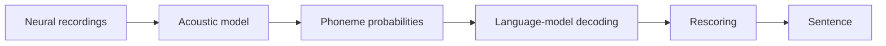

# Brain-to-Text: Neural Speech Decoding

> [!IMPORTANT]
> **Notice — repository contents have changed.**
> Earlier versions of this repository contained the full implementation, configuration and
> analysis of this work. We have found evidence that this material was copied and reused without
> attribution. Because the work is currently **in preparation for journal submission**, the source
> code and methodological details have been removed. This repository now reports results only.
>
> The method, code and results remain the original work of the author. Reproducing, redistributing
> or presenting any part of this work (including material taken from earlier versions of this
> repository) as your own is not permitted. Full details will be released with the publication.

Decoding attempted speech from intracortical neural recordings into English text, developed for the
Kaggle **[brain-to-text-25](https://www.kaggle.com/competitions/brain-to-text-25)** competition.

---

## Pipeline (overview)

```mermaid
flowchart LR
    A[Neural recordings] --> B[Acoustic model]
    B --> C[Phoneme probabilities]
    C --> D[Language-model decoding]
    D --> E[Rescoring]
    E --> F[Sentence]
```

1. **Neural features** from intracortical recordings are fed to a deep acoustic model.
2. The model predicts **phoneme probabilities** over time.
3. A **language-model decoder** turns these into candidate sentences.
4. Candidates are **rescored** and the best sentence is selected.

---

## Results

Word error rate (WER, %) on held-out validation trials that were not used for training or for
tuning any part of the system.

| System | WER (%) |
| ------ | ------: |
| Acoustic model only (no language model) | 44.63 |
| + language-model decoding | 5.96 |
| **Full system** | **3.38** |

- The language model removes most of the errors of the raw acoustic model.
- Rescoring gives a further **~43 % relative reduction** in WER over language-model decoding alone.
- Remaining errors are concentrated in a small number of recording sessions.

---

## Status

| | |
| --- | --- |
| Manuscript | In preparation |
| Code | Will be released upon publication |

## Contact

Anik Biswas — anik.eee@diu.edu.bd

For collaboration or academic enquiries, please get in touch by email.

## License

Copyright © 2026 Anik Biswas. All rights reserved. See [`LICENSE`](LICENSE).
